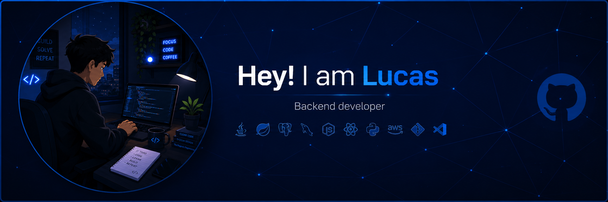

  

 

<h1 align="center">
  Hi 👋 I'm Lucas Silva Leão
</h1>

<h3 align="center">
  Backend Developer • Java • Spring Boot • Automation
</h3>

  Passionate about backend development, scalable systems, and real-world software solutions.

  Building REST APIs, automations, bots, and business systems.

---

## 🚀 About Me

- 🌍 Based in Brazil 🇧🇷
- 💻 Software Engineer focused on Backend Development and Automation
- 🚀 Currently building intelligent automations and scalable business solutions
- 🧠 Learning AWS Cloud, Software Architecture, and Scalable Backend Systems
- 👥 Open to collaboration, learning, and innovative projects
- ⚡ Passionate about technology and impactful software solutions

---

## 🛠️ Tech Stack

---

## 🌐 Connect With Me

---

## 📊 GitHub Stats

 

---

### 💡 "Turning ideas into scalable software solutions."

